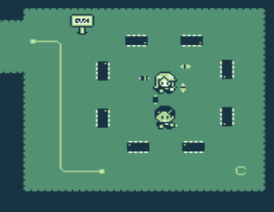
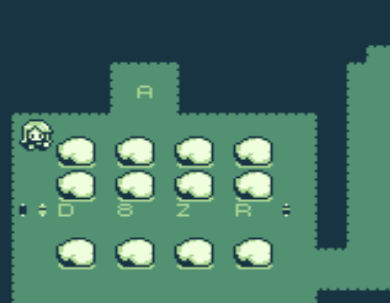
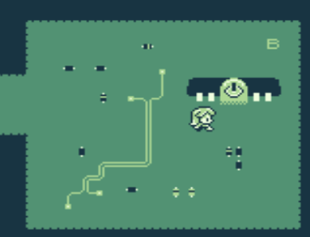
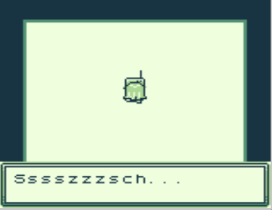
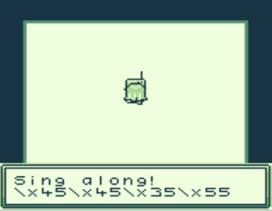

# PCB Land

The `.gb` extension and the `file` command suggest that this is a Game Boy ROM. Let's try to run it in an [online emulator](https://taisel.github.io/GameBoy-Online/).

To get the flag we just have to play the game.

The door is protected but, we can use voodoo.

Just move him ...

... and magically we can enter.

The scanned QR gives us: `THAINNOS{<Key-A>Z7X3<Key-B>}`

Key A is `D8ZR`

First the radio is useless, but after a few attempts we get:

Key B is (hex as ASCII) `EE5U`.

Putting these pieces together we get the flag.