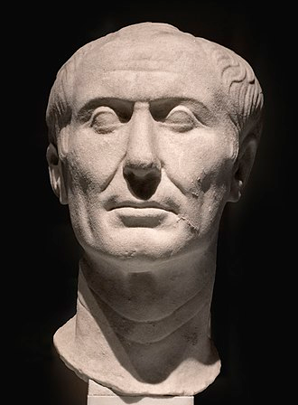

# Caesar's Microdot – Solution

Since microdot refers to a small piece of paper with a microphotograph on it, we can assume that the flag is hidden in the form of a small image in the pdf. We can extract all the images using:

```bash
pdfimages -all Caesar.pdf images
```

This gives us the following images:




The last image looks promising. Since the pdf is about Caesar, we can assume that the flag is hidden using the Caesar cipher. We can decrypt it using a shift of 3, which gives us the text inside the flag.
