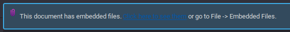

# See Appendix – Solution

Opening the file in the browser doesn't give us anything useful. Looking at the content we can guess it's a PDF file, which we can confirm using the `file` command.

```bash
$ file index.html
index.html: PDF document, version 1.5
```

Opening the PDF file in a PDF viewer, like Okular, we get the following:



Looking at the appendix, we see a base64 string. Decoding it gives us the flag.
